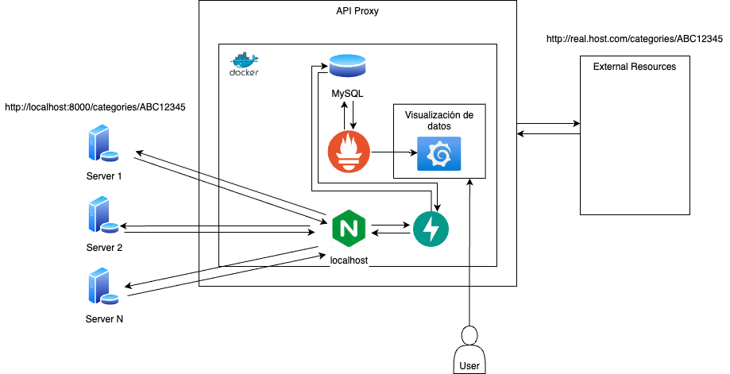

# Proxy de APIs con FastAPI, NGINX, Prometheus y Grafana
Este proyecto es un proxy de APIs desarrollado con FastAPI que utiliza NGINX para el control de acceso y límites de tasa, y Prometheus y Grafana para la monitorización y visualización de estadísticas.



## Requisitos previos
Antes de comenzar, el sistema deberá o ambiente virtual deberá tener instalado lo siguiente:

- Python 3.x
- Docker
- Nginx
- Mysql
- Prometheus
- Grafana
- Redis

## Instalación y configuración
1. Clonar el repositorio:  
   `git clone https://github.com/mariomtzjr/api_proxy.git`  
   `cd api_proxy`  
2. Instalación de dependencias:  
   `pip install -r requirements.txt`
3. Levantar docker:  
   `docker-compose build`  
   `docker-compose up` # Para ver logs y proceso de despliegue  
   `docker-compose up -d` # Para no obtener salida al levantar el contenedor 
4. Configuración de NGINX:
   - Copia el archivo nginx.conf a la ubicación de configuración de NGINX.
   - Actualiza la configuración; dirección del servidor y los límites de tasa (esta configuración dependerá de tus necesidades).
5. Configuración de Prometheus:  
   - Copia el archivo prometheus.yml a la ubicación de configuración de Prometheus.
   - Actualiza la configuración según la dirección del servidor de FastAPI.
6. Inicialización de  FastAPI:
   `uvicorn proxy:app --host 0.0.0.0 --port 8000`
7. Inicialización de NGINX:  
   `sudo systemctl start nginx`
8. Inicialización de Prometheus:
   `./prometheus --config.file=prometheus.yml`
9.  Inicialización de Grafana:
   - Accede a la interfaz web de Grafana, usuario por defaualt `admin`, password `admin`
   - Configura un origen de datos Prometheus.
   - Importa un panel predefinido para visualizar las métricas de FastAPI.

## Ejecución de Tests
`pytest -v test/api/test_proxy.py`

### Dashboard de Prometheus
Abre una ventana del navegador y escribe la siguiente dirección:  
`localhost:9090`

### Dashboard de grafana
Abre una ventana del navegador y escribe la siguiente dirección (usuario y password default: admin/admin):  
`localhost:3000`  

#### Nota
1. Si por alguna razón, cuando inicies por primera vez la aplicación obtienes el siguiente error:  
   `"Unknown database 'database_name'"`,  
   La manera de solucionarlo es entrando al contenedor mysql(database). Para realizar eso, debes ejecutar el siguiente comando (sin detener los servicios) `docker exec -it database /bin/bash`. Dentro del contenedor, ejecuta el siguiente comando: `mysql -u root -p`, el password, es el valor que configurarás en tu variable de ambiente _MYSQL_ROOT_PASSWORD_. En este momento ya estás dentro del servicio de mysql. La salida de la terminal será como esta:  
   ```
   Welcome to the MySQL monitor.  Commands end with ; or \g.
   Your MySQL connection id is 9
   Server version: 8.3.0 MySQL Community Server - GPL

   Copyright (c) 2000, 2024, Oracle and/or its affiliates.

   Oracle is a registered trademark of Oracle Corporation and/or its
   affiliates. Other names may be trademarks of their respective
   owners.

   Type 'help;' or '\h' for help. Type '\c' to clear the current input statement.

   mysql>
   ```  
   Ejecuta el siguiente query SQL:  
   ```
   CREATE DATABASE database_name;
   ```  
   Ejecuta `exit` para salir del servicio de mysql, y nuevamente `exit` para salir del contenedor.  
   ¡Listo!, Ya puedes reiniciar el servicio de docker que presentó el error.
